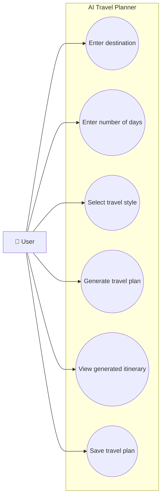

# Use Case Diagram

```mermaid
graph LR
    %% Actor on the left
    User["👤 User"]

    %% System box with use cases inside
    subgraph System [AI Travel Planner]
        UC1((Enter destination))
        UC2((Enter number of days))
        UC3((Select travel style))
        UC4((Generate travel plan))
        UC5((View generated itinerary))
        UC6((Save travel plan))
    end

    %% Connections from actor to use cases
    User --> UC1
    User --> UC2
    User --> UC3
    User --> UC4
    User --> UC5
    User --> UC6
```