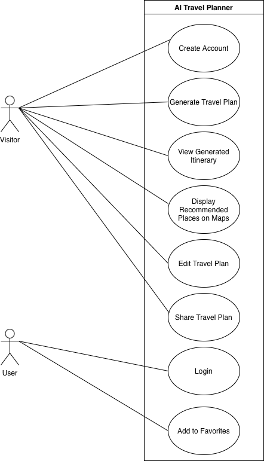
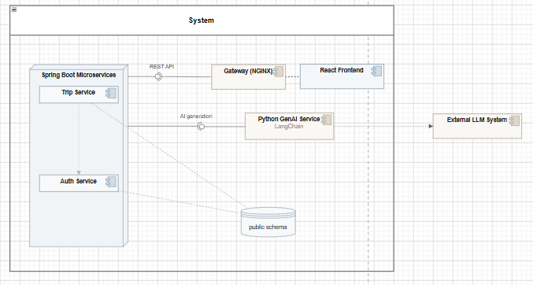

# System Overview — Architecture

## 1. Overview

AI Travel Planner is a microservice-based web application that generates personalized travel itineraries.

Users currently provide:

- a destination
- travel duration
- travel preferences

The application generates a structured day-by-day itinerary. Authenticated users can save their trips and share them through a generated link.

The GenAI API also supports optional budget information. However, budget input is not yet connected to the complete frontend and backend workflow and is therefore considered a future improvement.

## 2. Current System Architecture

The implemented system consists of:

- React Client
- NGINX API Gateway
- Auth Service
- Trip Service
- Common backend module
- GenAI Service
- PostgreSQL
- Prometheus
- Grafana

The main request flow is:

```txt
Browser
   |
   v
React Client
   |
   v
NGINX API Gateway
   |
   +----------------+----------------+----------------+
   |                |                |
   v                v                v
Auth Service    Trip Service    GenAI Service
   |                |                |
   +--------+-------+                |
            |                        v
            v                 External LLM Provider
       PostgreSQL
```

The monitoring flow is:

```txt
Auth Service ----+
Trip Service ----+----> Prometheus ----> Grafana
GenAI Service ---+
```

## 3. Components

### 3.1 React Client

The client is a React single-page application.

Current responsibilities:

- collect destination, duration, and preference input
- register and authenticate users
- submit itinerary generation requests
- display generated itineraries
- save trips
- share trips through generated links
- communicate with backend services through the API Gateway

The frontend does not currently collect budget information.

### 3.2 NGINX API Gateway

NGINX provides the public API entrypoint for the local application.

It routes requests to the internal services:

| External Route | Internal Service |
|---|---|
| `/api/v1/auth/*` | Auth Service |
| `/api/v1/trips/*` | Trip Service |
| `/api/v1/genai/*` | GenAI Service |
| `/genai/health` | GenAI Service |

Auth and Trip use shorter internal routes. NGINX rewrites the public versioned paths where necessary.

### 3.3 Auth Service

The Auth Service is a Spring Boot microservice responsible for authentication and user access.

Responsibilities:

- user registration
- user login
- password encoding
- authentication validation
- JWT generation
- user persistence

Technology:

```txt
Java 21
Spring Boot
Spring Security
Spring Data JPA
```

### 3.4 Trip Service

The Trip Service is a Spring Boot microservice responsible for the trip domain.

Responsibilities:

- validate trip requests
- store and retrieve trip data
- manage itinerary-related persistence
- integrate with the GenAI Service for itinerary generation

Technology:

```txt
Java 21
Spring Boot
Spring Data JPA
```

### 3.5 Common Module

The Common module is a shared Java library used by the backend services.

It contains reusable structures for:

- API responses
- error responses
- validation errors
- shared exceptions

It is not deployed as an independent service.

### 3.6 GenAI Service

The GenAI Service is an independent Python and FastAPI microservice.

Responsibilities:

- build prompts from trip parameters
- generate structured itineraries
- provide travel suggestions
- validate structured responses
- isolate LLM-specific logic from the Java services
- support interchangeable generation providers

Technology:

```txt
Python 3.12
FastAPI
Pydantic
LangChain OpenAI
```

The service currently provides:

```txt
GET  /genai/health
POST /api/v1/genai/generate
POST /api/v1/genai/suggest
GET  /metrics
```

The provider architecture includes:

- a deterministic mock provider for local development and CI
- an OpenAI provider for external LLM generation

The generation model accepts optional budget information, but this field is not currently included in the complete user-facing workflow.

The GenAI Service is stateless and does not own database tables.

### 3.7 PostgreSQL

PostgreSQL stores persistent data for the backend services.

Current ownership is divided by application responsibility:

| Data | Owner |
|---|---|
| Users and authentication data | Auth Service |
| Trips and itinerary-related data | Trip Service |

The GenAI Service does not persist generated data directly.

## 4. Service Communication

### Client-to-Service Communication

The React Client sends external API requests through the NGINX API Gateway.

```txt
React Client
    |
    v
NGINX API Gateway
    |
    v
Backend or GenAI Service
```

The client does not use Docker-internal service names.

### Internal Communication

Containers communicate through the Docker network using service names such as:

```txt
auth-service
trip-service
genai
postgres
prometheus
```

The Trip Service calls the GenAI Service over HTTP when itinerary generation is required.

The GenAI API contract is defined in:

```txt
api/openapi.yaml
```

## 5. Main Application Flow

A typical workflow is:

1. The user opens the React Client.
2. The user registers or logs in.
3. The Auth Service validates the request.
4. The user enters a destination, duration, and travel preferences.
5. The request is forwarded through the API Gateway.
6. The GenAI Service generates a structured itinerary.
7. The itinerary is displayed in the frontend.
8. The authenticated user can save the trip.
9. The Trip Service persists the trip in PostgreSQL.
10. The user can share the trip through a generated link.

## 6. Monitoring Architecture

Prometheus collects metrics from:

- Auth Service
- Trip Service
- GenAI Service
- Prometheus itself

Grafana uses Prometheus as its default datasource and provides dashboards for:

- service availability
- HTTP request rate
- HTTP error rate
- average request latency

Monitoring configuration is stored under:

```txt
infra/monitoring/
```

Operational instructions are documented in:

```txt
infra/README.md
```

## 7. Deployment Architecture

### Local Environment

The local environment is orchestrated with Docker Compose and includes:

- application services
- PostgreSQL
- NGINX
- Prometheus
- Grafana

### Kubernetes

The application can be deployed to Kubernetes with Helm.

The Helm chart and deployment instructions are located under:

```txt
infra/helm/
```

### Azure

Terraform and Ansible support Azure infrastructure and VM deployment:

- Terraform provisions infrastructure resources.
- Ansible configures the VM and deploys the application.

Detailed deployment instructions are maintained separately and are not duplicated in this document.

## 8. CI/CD

GitHub Actions provides automated integration and deployment workflows.

The workflows validate and build the relevant project components, including:

- frontend
- backend services
- GenAI Service
- Docker Compose configuration
- Terraform
- Ansible

Deployment secrets are managed outside the repository.

## 9. UML and Design Diagrams

The diagrams in this section were initially created from the planned product scope. Some classes and use cases represent future functionality and do not necessarily correspond to separate implemented services.

### 9.1 Analysis Object Model

The analysis object model describes the main domain concepts and their relationships.

> **File:** [diagrams/analysis-object-model.md](diagrams/analysis-object-model.md)  
> Open the file with diagrams.net using **File → Import From → Device**.

Key domain concepts include:

```txt
User
TripRequest
TravelPreference
TravelPlan
Itinerary
ItineraryDay
Activity
Location
Route
GenAIService
```

Main relationships:

- a user submits trip requests
- a trip request contains destination, duration, and preferences
- the GenAI Service generates a travel plan
- a travel plan contains an itinerary
- an itinerary contains itinerary days
- each itinerary day contains activities
- a registered user can save and share a trip

`Route`, map-related location behavior, and favourites may appear in the domain model but are not fully implemented in the current end-to-end application.

### 9.2 Use Case Diagram



Current use cases include:

- register
- login
- generate a travel plan
- view a day-by-day itinerary
- save a trip
- share a trip through a link

Planned or partially implemented use cases include:

- display activities on a map
- reorder or replace activities
- mark trips as favourites
- export travel plans
- provide end-to-end budget-aware planning

### 9.3 Top-Level Component Diagram



The existing component diagram was based on the initial proposed architecture and may contain components such as:

- Planning Service
- Location Service
- User Service
- multiple service-specific database schemas

These components are not separate deployed services in the current implementation.

The current deployed backend consists of:

- Auth Service
- Trip Service
- Common module
- GenAI Service

The diagram should be updated separately if an implementation-accurate component diagram is required.

## 10. Current and Planned Scope

### Implemented

- registration and login
- destination, duration, and preference input
- AI itinerary generation
- trip persistence
- link-based trip sharing
- mock and OpenAI generation providers
- API Gateway routing
- Prometheus monitoring
- Grafana dashboard provisioning
- Docker Compose local deployment
- Helm-based Kubernetes deployment
- Terraform and Ansible automation

### Future or Incomplete

- frontend budget input
- backend budget forwarding
- budget-aware itinerary presentation
- route optimization
- map-based itinerary visualization
- drag-and-drop activity editing
- favourites
- monitoring notification channels
- separate Planning or Location services

## 11. Related Documentation

| Document | Purpose |
|---|---|
| `README.md` | Project overview and entry point |
| `docs/how-to-launch.md` | Short local launch guide |
| `infra/README.md` | Local infrastructure and monitoring |
| `genai/README.md` | GenAI providers, endpoints, and development |
| `infra/helm/README.md` | Kubernetes deployment |
| `docs/infrastructure-automation.md` | Terraform and Ansible |
| `docs/product-backlog.md` | Product scope and planned features |
| `CONTRIBUTING.md` | Contribution workflow |